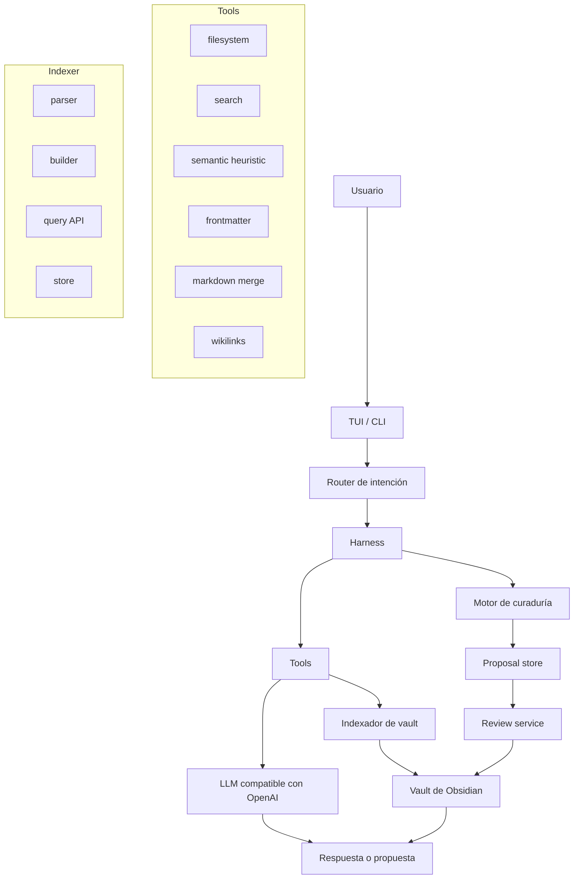

# Librarian

> Agente experimental local-first para mantener una LLM Wiki en un vault de Obsidian.

> **Prefer to read in English?** → [README.md](README.md)

Librarian es un agente de IA que ayuda a mantener la capa de conocimiento de un vault de Obsidian. No es la wiki en sí: es el bibliotecario que lee fuentes inmutables, propone páginas estructuradas, encuentra huecos, detecta notas débiles y genera reportes revisables.

Implementa el [patrón LLM Wiki](https://gist.github.com/karpathy/442a6bf555914893e9891c11519de94f): en vez de buscar documentos crudos desde cero en cada pregunta, la IA construye y mantiene incrementalmente una wiki persistente, estructurada e interconectada en Markdown.

## Estado

Librarian está en alpha experimental.

Hoy es útil para usuarios técnicos de Obsidian que se sienten cómodos con CLI, Markdown, configuración local y revisión de cambios generados. Todavía no es un plugin pulido de Obsidian ni un gestor de conocimiento completamente autónomo.

Primero corré Librarian sobre una copia de tu vault.

## Por Qué Existe

Las herramientas RAG tradicionales te dejan chatear con documentos, pero cada pregunta empieza casi desde cero. Librarian usa otro enfoque: mantiene una capa durable `wiki/` dentro de tu vault.

El objetivo no es reemplazar tu pensamiento. El objetivo es sacar del medio el bookkeeping que hace que las wikis personales se degraden: links faltantes, conceptos duplicados, páginas obsoletas, resúmenes débiles, notas huérfanas y síntesis olvidadas.

## Modelo Del Vault

Librarian espera un vault con estas capas:

```text
vault/
  1-proyectos/  # Carpetas PARA opcionales del Second Brain Ecosystem.
  2-areas/
  3-recursos/
  4-archivo/
  daily/
  inbox/        # Inbox humano. No se procesa automáticamente.
  templates/
  home.md

  raw/          # Fuentes inmutables. Librarian lee, nunca reescribe.
  wiki/         # Páginas mantenidas por IA.
    index.md
    log.md
    conceptos/
    entidades/
    sources/
    synthesis/
  reports/      # Reportes, diagnósticos y artefactos de revisión.
    chats/      # Sesiones de chat persistidas.
    conflicts/  # Archivos de conflictos de merge.
  reviews/      # Superficie humana de revisión/export.
  memory/       # Memoria persistente del agente/sesiones.
  configs/      # Configuración visible/editable de Librarian.
  .librarian/   # Estado interno, índices, cache, locks, propuestas.
    state/      # Índice y ledger de procesados.
    proposals/  # Fuente de verdad de propuestas.
```

Reglas base:

- `raw/` es la fuente de verdad. Librarian nunca modifica archivos aquí.
- `wiki/` es conocimiento mantenido. Solo se modifica vía approve/apply.
- `reports/` guarda diagnósticos y logs de chat.
- `reviews/` es una superficie humana de revisión/export. No es la fuente de verdad de propuestas.
- `.librarian/proposals/` es la fuente de verdad de propuestas.
- `wiki/` solo se modifica vía approve/apply.
- `inbox/` sigue siendo captura humana; mové a `raw/` solo las fuentes que querés que Librarian procese.

## Qué Funciona Hoy

- **TUI interactiva** construida con Ink (React para terminales) con metáfora de workspace y 12 vistas renderer.
- **Router de intención** para acciones comunes (regex + fallback a LLM).
- **Indexador de vault** que recorre el vault, parsea frontmatter/headings/wikilinks/tags, computa backlinks, y persiste un índice JSON en `.librarian/state/index.json`.
- **API de queries** con búsqueda por path/título/tag/sección, backlinks, forward links, huérfanas, stats de grafo, notas stale/incompletas, búsqueda semántica con Jaccard, pathfinding BFS, y ranking de similaridad.
- **Búsqueda semántica heurística** sobre páginas Markdown de la wiki.
- **Motor de curaduría** que clasifica notas raw vía LLM en categorías wiki (`conceptos`, `entidades`, `sources`, `synthesis`), detecta duplicados por filename y semánticos, y genera propuestas.
- **Sistema de propuestas y revisión** con máquina de estados (`pending → approved → applying → applied` o `pending → rejected`), persistencia file-based, y ledger de procesados con file locking.
- **Subcomandos CLI** para el ciclo de vida de propuestas: `proposals`, `preview`, `approve`, `reject`, `apply`.
- **Reportes wiki**: estado, páginas incompletas, notas stale, notas huérfanas y grafo de conexiones.
- **Chat contextual** usando resultados de búsqueda en la wiki, con persistencia de chat como Markdown.
- **Curaduría batch** de notas raw vía `scripts/process-raw.js` — genera propuestas, no escribe wiki directamente.
- **Comandos slash de la TUI**: `/search`, `/status`, `/process`, `/review`, `/graph`, `/orphans`, `/stale`.
- **Suite de tests completa** con más de 30 archivos de test.

## Qué Falta

- Setup wizard pulido.
- Plugin de Obsidian.
- Base vectorial real en la implementación actual.
- Ingesta PDF/EPUB.
- Algunas rutas de escritura siguen siendo experimentales.
- El uso de modelos cloud es opt-in por variables de entorno, pero la privacidad depende del proveedor elegido.

## Seguridad

Librarian trabaja con bases de conocimiento personales. Sé conservadora/o.

- Empezá con una copia de tu vault.
- Usá `--dry-run` para procesamiento batch.
- Mantené tu vault en Git u otro sistema de backup.
- Revisá archivos generados antes de confiar en ellos.
- No apuntes Librarian a notas sensibles si configurás un modelo cloud.
- `raw/` está pensado como solo lectura, pero el proyecto está en alpha.

Ver [SAFETY.md](SAFETY.md) para el modelo completo de seguridad.

## Instalación

```bash
git clone git@github.com:Agents4Life/librarian.git
cd librarian
npm install
npm run build
npm link
```

Después de `npm link`, el comando `librarian` queda disponible globalmente.

Se requiere Node.js 22+.

## Configuración

Definí la ruta de tu vault antes de correr comandos:

```bash
export LIBRARIAN_VAULT_PATH="/ruta/a/tu/vault/obsidian"
```

También podés partir desde el template de entorno:

```bash
cp .env.example .env
```

Para scripts batch, `VAULT_PATH` también está soportado por compatibilidad:

```bash
export VAULT_PATH="/ruta/a/tu/vault/obsidian"
```

Copiá `config.example.yaml` si querés un archivo local documentado:

```bash
cp config.example.yaml config.yaml
```

`config.yaml` está ignorado por Git porque puede contener rutas locales o configuración de proveedores.

## Proveedores De Modelo

Por defecto, Librarian apunta a un endpoint local de Ollama compatible con OpenAI:

```bash
export OLLAMA_BASE_URL="http://127.0.0.1:11434/v1"
export OLLAMA_MODEL="qwen3.5:4b"
```

Podés configurar otro endpoint compatible con OpenAI usando las mismas variables. Si configurás `ZAI_API_KEY`, Librarian envía un header `Authorization` cuando corresponde.

Librarian usa `fetch()` nativo — no tiene SDK externo de LLM. Soporta endpoints primario y fallback con timeout configurable.

La privacidad depende del proveedor:

- Ollama local: las notas se quedan en tu máquina o red local.
- Proveedor cloud: fragmentos seleccionados de notas pueden enviarse a ese proveedor.

## Uso

### TUI Interactiva

```bash
librarian
```

La TUI usa una metáfora de workspace con múltiples vistas. Dentro de la TUI, usá comandos slash:

| Comando | Acción |
|---------|--------|
| `/search <query>` | Buscar en la wiki |
| `/status` | Vista general del estado |
| `/process` | Procesar notas raw |
| `/review` | Revisar propuestas |
| `/graph` | Grafo de conexiones |
| `/orphans` | Mostrar notas huérfanas |
| `/stale` | Mostrar notas stale (90+ días) |

### Consulta Única

```bash
librarian "buscar Clean Architecture"
librarian "estado de la wiki"
librarian "pregunta sobre Clean Architecture"
```

La CLI devuelve JSON.

### Workflow De Propuestas

Librarian usa un flujo proposal-first para todas las escrituras al vault:

```bash
librarian proposals                      # Listar todas las propuestas
librarian proposals --status=pending     # Filtrar por estado
librarian proposal <id>                  # Ver detalles de una propuesta
librarian preview <id>                   # Previsualizar contenido
librarian approve <id>                   # Aprobar una propuesta
librarian reject <id> --reason="..."     # Rechazar con un motivo
librarian apply <id>                     # Ejecutar una propuesta aprobada
```

Estados de propuesta: `pending → approved → applying → applied` o `pending → rejected`.

### Procesamiento Batch De Raw

Previsualizar propuestas sin escribir:

```bash
node scripts/process-raw.js --dry-run --limit 10
```

El modo live genera propuestas en `.librarian/proposals/`. Revisalas y aplicalas con:

```bash
node scripts/process-raw.js --limit 10
librarian proposals
librarian preview <id>
librarian approve <id>
librarian apply <id>
```

## Arquitectura



### Subsistemas Principales

| Subsistema | Ubicación | Propósito |
|------------|-----------|-----------|
| Router de intención | `src/router.ts` | Rutea input a tools vía regex + fallback a LLM |
| Harness | `src/harness.ts` | Orquesta tools según la intención ruteada |
| Cliente LLM | `src/llm.ts` | Cliente OpenAI-compatible con primario/fallback, `fetch()` nativo |
| Indexador de vault | `src/indexer/` | Recorre el vault, parsea frontmatter/headings/links/tags, computa backlinks, persiste índice JSON |
| Motor de curaduría | `src/curation.ts` | Clasifica notas raw, detecta duplicados, genera propuestas de páginas wiki |
| Proposal store | `src/proposals/` | Persistencia file-based JSON en `.librarian/proposals/` |
| Review service | `src/review/` | Máquina de estados para ciclo de vida de propuestas, ledger de procesados con file locking |
| TUI | `src/tui/` | TUI con Ink + React, metáfora de workspace, 12 renderers |
| Tools | `src/tools/` | filesystem, search, semantic, frontmatter, wikilinks, markdown-merge |

## Relación Con Second Brain Ecosystem

Librarian es la capa de IA del [Second Brain Ecosystem](https://github.com/VanessaPellegrini/second-brain-ecosystem), una guía para construir un sistema de conocimiento personal con Obsidian.

La introducción conceptual vive en la guía 07: Siguiente Nivel con IA.

## Desarrollo

```bash
npm run dev         # Correr con tsx (modo dev)
npm run typecheck   # Type-check sin emitir
npm test            # Correr tests
npm run build       # Compilar TypeScript a dist/
```

## Licencia

MIT
