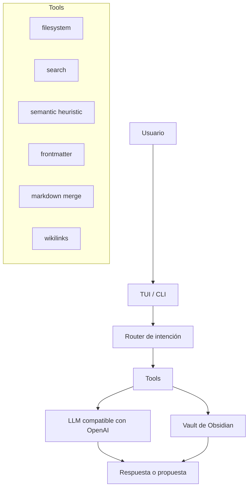

# Librarian

> Agente experimental local-first para mantener una LLM Wiki en un vault de Obsidian.

> **Prefer to read in English?** → [README.md](README.md)

Librarian es un agente de IA que ayuda a mantener la capa de conocimiento de un vault de Obsidian. No es la wiki en sí: es el bibliotecario que lee fuentes inmutables, propone páginas estructuradas, encuentra huecos, detecta notas débiles y genera reportes revisables.

Implementa el [patrón LLM Wiki](https://gist.github.com/karpathy/442a6bf555914893e9891c11519de94f): en vez de buscar documentos crudos desde cero en cada pregunta, la IA construye y mantiene incrementalmente una wiki persistente, estructurada e interconectada en Markdown.

## Estado

Librarian está en alpha experimental.

Hoy es útil para usuarios técnicos de Obsidian que se sienten cómodos con CLI, Markdown, configuración local y revisión de cambios generados. Todavía no es un plugin pulido de Obsidian ni un gestor de conocimiento completamente autónomo.

Primero corré Librarian sobre una copia de tu vault.

## Por Qué Existe

Las herramientas RAG tradicionales te dejan chatear con documentos, pero cada pregunta empieza casi desde cero. Librarian usa otro enfoque: mantiene una capa durable `wiki/` dentro de tu vault.

El objetivo no es reemplazar tu pensamiento. El objetivo es sacar del medio el bookkeeping que hace que las wikis personales se degraden: links faltantes, conceptos duplicados, páginas obsoletas, resúmenes débiles, notas huérfanas y síntesis olvidadas.

## Modelo Del Vault

Librarian espera un vault con estas capas:

```text
vault/
  1-proyectos/  # Carpetas PARA opcionales del Second Brain Ecosystem.
  2-areas/
  3-recursos/
  4-archivo/
  daily/
  inbox/        # Inbox humano. No se procesa automáticamente.
  templates/
  home.md

  raw/          # Fuentes inmutables. Librarian lee, no reescribe.
  wiki/         # Páginas mantenidas por IA.
    index.md
    log.md
    conceptos/
    entidades/
    sources/
    synthesis/
  reportes/     # Reportes, diagnósticos y propuestas revisables.
```

Reglas base:

- `raw/` es la fuente de verdad.
- `wiki/` es conocimiento mantenido.
- `reportes/` guarda diagnósticos y propuestas.
- `inbox/` sigue siendo captura humana; mové a `raw/` solo las fuentes que querés que Librarian procese.

## Qué Funciona Hoy

- TUI interactiva con Ink.
- Router de intención para acciones comunes.
- Inspección de inbox en `raw/`.
- Búsqueda semántica heurística sobre páginas Markdown en `wiki/`.
- Reportes de estado, páginas incompletas, stale notes, huérfanas y grafo.
- Chat contextual usando resultados de búsqueda en la wiki.
- Propuestas batch de curaduría vía `scripts/process-raw.js`.
- Tests para las tools principales y el harness.

## Qué Falta

- Setup wizard pulido.
- Plugin de Obsidian.
- Base robusta de aprobaciones.
- Base vectorial real en la implementación actual.
- Ingesta PDF/EPUB.
- Algunas rutas de escritura siguen siendo experimentales.
- El uso de modelos cloud es opt-in por variables de entorno, pero la privacidad depende del proveedor elegido.

## Seguridad

Librarian trabaja con bases de conocimiento personales. Sé conservadora/o.

- Empezá con una copia de tu vault.
- Usá `--dry-run` para procesamiento batch.
- Mantené tu vault en Git u otro sistema de backup.
- Revisá archivos generados antes de confiar en ellos.
- No apuntes Librarian a notas sensibles si configurás un modelo cloud.
- `raw/` está pensado como solo lectura, pero el proyecto está en alpha.

Ver [SAFETY.md](SAFETY.md) para el modelo completo de seguridad.

## Instalación Para Desarrollo

```bash
git clone git@github.com:Agents4Life/librarian.git
cd librarian
npm install
npm run build
npm link
```

Se recomienda Node.js 22+.

## Configuración

Definí la ruta de tu vault antes de correr comandos:

```bash
export LIBRARIAN_VAULT_PATH="/ruta/a/tu/vault/obsidian"
```

También podés partir desde el template de entorno:

```bash
cp .env.example .env
```

Para scripts batch, `VAULT_PATH` también está soportado por compatibilidad:

```bash
export VAULT_PATH="/ruta/a/tu/vault/obsidian"
```

Copiá `config.example.yaml` si querés un archivo local documentado:

```bash
cp config.example.yaml config.yaml
```

`config.yaml` está ignorado por Git porque puede contener rutas locales o configuración de proveedores.

## Proveedores De Modelo

Por defecto, Librarian apunta a un endpoint local de Ollama compatible con OpenAI:

```bash
export OLLAMA_BASE_URL="http://127.0.0.1:11434/v1"
export OLLAMA_MODEL="qwen3.5:4b"
```

Podés configurar otro endpoint compatible con OpenAI usando las mismas variables. Si configurás una API key de proveedor, Librarian envía un header `Authorization` cuando corresponde.

La privacidad depende del proveedor:

- Ollama local: las notas se quedan en tu máquina o red local.
- Proveedor cloud: fragmentos seleccionados de notas pueden enviarse a ese proveedor.

## Uso

### TUI Interactiva

```bash
librarian
```

Menú actual:

```text
Librarian

1. Procesar notas nuevas
2. Buscar en la wiki
3. Preguntar a Ollama
4. Estado de la wiki
5. Paginas incompletas
6. Notas sin tocar 90 dias
7. Mapa de conexiones

q. Salir
```

### Consulta Única

```bash
librarian "buscar Clean Architecture"
librarian "estado de la wiki"
librarian "pregunta sobre Clean Architecture"
```

La CLI devuelve JSON.

### Procesamiento Batch De Raw

Previsualizar propuestas sin escribir:

```bash
node scripts/process-raw.js --dry-run --limit 10
```

El modo live escribe páginas generadas en la wiki y puede actualizar metadata de procesamiento. Usalo solo después de revisar el dry-run:

```bash
node scripts/process-raw.js --limit 10
```

## Arquitectura



## Documentación

| Archivo | Propósito |
|---------|-----------|
| [SAFETY.md](SAFETY.md) | Seguridad, privacidad y comportamiento de escritura |
| [CONTRIBUTING.md](CONTRIBUTING.md) | Cómo contribuir |
| [SOUL.md](SOUL.md) | Identidad y comportamiento del agente |
| [PRD.md](PRD.md) | Visión de producto y alcance |
| [docs/product/CONTEXT.md](docs/product/CONTEXT.md) | Lenguaje del dominio e invariantes |
| [docs/design/IDEA.md](docs/design/IDEA.md) | Notas de diseño y modelo mental |
| [docs/design/contracts/tools.md](docs/design/contracts/tools.md) | Contratos de tools |
| [docs/adr/](docs/adr/) | Architectural Decision Records |

## Relación Con Second Brain Ecosystem

Librarian es la capa de IA del [Second Brain Ecosystem](https://github.com/VanessaPellegrini/second-brain-ecosystem), una guía para construir un sistema de conocimiento personal con Obsidian.

La introducción conceptual vive en la guía 07: Siguiente Nivel con IA.

## Desarrollo

```bash
npm run typecheck
npm test
npm run build
```

## Licencia

MIT
