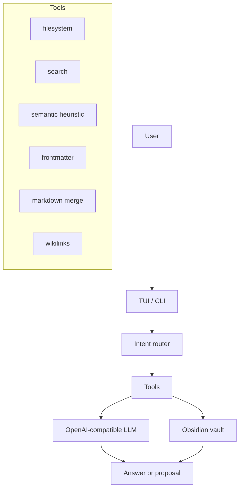

# Librarian

> Experimental local-first agent for maintaining an Obsidian LLM Wiki.

> **Preferís leer en español?** → [README.es.md](README.es.md)

Librarian is an AI agent that helps maintain the knowledge layer of an Obsidian vault. It is not the wiki itself. It is the librarian that reads immutable source notes, proposes structured wiki pages, finds gaps, surfaces stale notes, and generates reviewable reports.

It implements the [LLM Wiki pattern](https://gist.github.com/karpathy/442a6bf555914893e9891c11519de94f): instead of searching raw documents from scratch on every question, an AI incrementally builds and maintains a persistent, structured, interlinked Markdown wiki that compounds over time.

## Status

Librarian is experimental alpha software.

It is useful today for technical Obsidian users who are comfortable with a CLI, Markdown files, local config, and reviewing generated changes. It is not yet a polished Obsidian plugin or a fully autonomous knowledge manager.

Run it on a copy of your vault first.

## Why This Exists

Traditional RAG tools let you chat with documents, but each question starts mostly from zero. Librarian takes a different approach: it helps maintain a durable `wiki/` layer inside your vault.

The goal is not to replace thinking. The goal is to remove the bookkeeping that makes personal wikis decay: missing links, duplicate concepts, stale pages, weak summaries, orphan notes, and forgotten synthesis.

## Vault Model

Librarian expects a vault with three layers:

```text
vault/
  1-proyectos/  # Optional PARA folders from Second Brain Ecosystem.
  2-areas/
  3-recursos/
  4-archivo/
  daily/
  inbox/        # Human capture inbox. Not processed automatically.
  templates/
  home.md

  raw/          # Immutable sources. Librarian should read, not rewrite.
  wiki/         # AI-maintained pages.
    index.md
    log.md
    conceptos/
    entidades/
    sources/
    synthesis/
  reportes/     # Reports, diagnostics, proposals, and review artifacts.
```

The core rule is simple:

- `raw/` is the source of truth.
- `wiki/` is maintained knowledge.
- `reportes/` is where diagnostics and proposals live.
- `inbox/` remains a human capture inbox; move only curated sources into `raw/` when you want Librarian to process them.

## What Works Today

- Interactive terminal UI with Ink.
- Intent routing for common actions.
- Raw inbox inspection.
- Heuristic semantic search over Markdown wiki pages.
- Wiki status, incomplete notes, stale notes, orphan notes, and graph reports.
- Contextual chat using wiki search results.
- Batch raw-note curation proposals through `scripts/process-raw.js`.
- Tests for the main tools and harness.

## What Is Not Finished

- No polished setup wizard yet.
- No Obsidian plugin yet.
- No robust approval database yet.
- No real vector database in the current implementation.
- PDF/EPUB ingestion is not implemented.
- Some write paths are still experimental and should be treated with caution.
- Cloud model usage is opt-in by environment variables, but privacy behavior depends on your chosen provider.

## Safety

Librarian works with personal knowledge bases. Be conservative.

- Start with a copy of your vault.
- Use `--dry-run` for batch processing.
- Keep your vault in Git or another backup system.
- Review generated files before trusting them.
- Do not point Librarian at sensitive notes if you configure a cloud model.
- `raw/` is intended to be read-only, but this project is alpha and write paths are still being hardened.

See [SAFETY.md](SAFETY.md) for the full safety model.

## Installation For Development

```bash
git clone git@github.com:Agents4Life/librarian.git
cd librarian
npm install
npm run build
npm link
```

Node.js 22+ is recommended.

## Configuration

Set your vault path before running commands:

```bash
export LIBRARIAN_VAULT_PATH="/path/to/your/obsidian/vault"
```

You can also start from the environment template:

```bash
cp .env.example .env
```

For batch scripts, `VAULT_PATH` is also supported for compatibility:

```bash
export VAULT_PATH="/path/to/your/obsidian/vault"
```

Copy `config.example.yaml` if you want a documented local config file:

```bash
cp config.example.yaml config.yaml
```

`config.yaml` is intentionally ignored by Git because it may contain local paths or provider settings.

## Model Providers

By default, Librarian targets a local OpenAI-compatible Ollama endpoint:

```bash
export OLLAMA_BASE_URL="http://127.0.0.1:11434/v1"
export OLLAMA_MODEL="qwen3.5:4b"
```

You may configure another OpenAI-compatible endpoint with the same environment variables. If you set `ZAI_API_KEY`, Librarian sends an `Authorization` header for providers that require it.

Privacy depends on the provider you choose:

- Local Ollama: notes stay on your machine or local network.
- Cloud provider: selected note content may be sent to that provider.

## Usage

### Interactive TUI

```bash
librarian
```

Current menu:

```text
Librarian

1. Procesar notas nuevas
2. Buscar en la wiki
3. Preguntar a Ollama
4. Estado de la wiki
5. Paginas incompletas
6. Notas sin tocar 90 dias
7. Mapa de conexiones

q. Salir
```

### Single Query

```bash
librarian "buscar Clean Architecture"
librarian "estado de la wiki"
librarian "pregunta sobre Clean Architecture"
```

The CLI returns JSON.

### Batch Raw Processing

Preview proposals without writing:

```bash
node scripts/process-raw.js --dry-run --limit 10
```

Live mode writes generated wiki pages and may update processing metadata. Use it only after reviewing dry-run output:

```bash
node scripts/process-raw.js --limit 10
```

## Architecture



## Documentation

| File | Purpose |
|------|---------|
| [SAFETY.md](SAFETY.md) | Safety, privacy, and write behavior |
| [CONTRIBUTING.md](CONTRIBUTING.md) | How to contribute |
| [SOUL.md](SOUL.md) | Agent identity and behavior |
| [PRD.md](PRD.md) | Product vision and scope |
| [docs/product/CONTEXT.md](docs/product/CONTEXT.md) | Domain language and invariants |
| [docs/design/IDEA.md](docs/design/IDEA.md) | Design notes and mental model |
| [docs/design/contracts/tools.md](docs/design/contracts/tools.md) | Tool contracts |
| [docs/adr/](docs/adr/) | Architectural Decision Records |

## Relationship To Second Brain Ecosystem

Librarian is the AI layer of the [Second Brain Ecosystem](https://github.com/VanessaPellegrini/second-brain-ecosystem), a beginner-friendly guide to building a personal knowledge system with Obsidian.

The conceptual introduction lives in Guide 07: Next Level with AI.

## Development

```bash
npm run typecheck
npm test
npm run build
```

## License

MIT
