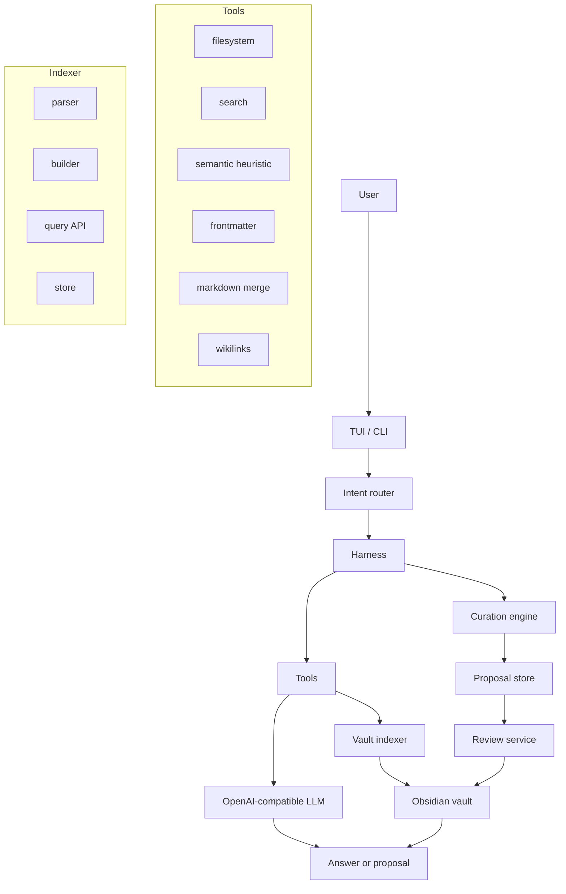

# Librarian

> Experimental local-first agent for maintaining an Obsidian LLM Wiki.

> **Preferís leer en español?** → [README.es.md](README.es.md)

Librarian is an AI agent that helps maintain the knowledge layer of an Obsidian vault. It is not the wiki itself. It is the librarian that reads immutable source notes, proposes structured wiki pages, finds gaps, surfaces stale notes, and generates reviewable reports.

It implements the [LLM Wiki pattern](https://gist.github.com/karpathy/442a6bf555914893e9891c11519de94f): instead of searching raw documents from scratch on every question, an AI incrementally builds and maintains a persistent, structured, interlinked Markdown wiki that compounds over time.

## Status

Librarian is experimental alpha software.

It is useful today for technical Obsidian users who are comfortable with a CLI, Markdown files, local config, and reviewing generated changes. It is not yet a polished Obsidian plugin or a fully autonomous knowledge manager.

Run it on a copy of your vault first.

## Why This Exists

Traditional RAG tools let you chat with documents, but each question starts mostly from zero. Librarian takes a different approach: it helps maintain a durable `wiki/` layer inside your vault.

The goal is not to replace thinking. The goal is to remove the bookkeeping that makes personal wikis decay: missing links, duplicate concepts, stale pages, weak summaries, orphan notes, and forgotten synthesis.

## Vault Model

Librarian expects a vault with three layers:

```text
vault/
  1-proyectos/  # Optional PARA folders from Second Brain Ecosystem.
  2-areas/
  3-recursos/
  4-archivo/
  daily/
  inbox/        # Human capture inbox. Not processed automatically.
  templates/
  home.md

  raw/          # Immutable sources. Librarian reads, never rewrites.
  wiki/         # AI-maintained pages.
    index.md
    log.md
    conceptos/
    entidades/
    sources/
    synthesis/
  reportes/     # Reports, diagnostics, proposals, and review artifacts.
    chats/      # Persisted chat sessions.
    conflicts/  # Merge conflict files.
```

The core rule is simple:

- `raw/` is the source of truth. Librarian never modifies files here.
- `wiki/` is maintained knowledge.
- `reportes/` is where diagnostics, proposals, and chat logs live.
- `inbox/` remains a human capture inbox; move only curated sources into `raw/` when you want Librarian to process them.

## What Works Today

- **Interactive TUI** built with Ink (React for terminals) with workspace metaphor and 12 renderer views.
- **Intent routing** for common actions (regex + LLM fallback).
- **Vault indexer** that walks the vault, parses frontmatter/headings/wikilinks/tags, computes backlinks, and persists a JSON index to `.librarian/state/index.json`.
- **Query API** with path/title/tag/section lookup, backlinks, forward links, orphans, graph stats, stale/incomplete notes, Jaccard-based semantic search, BFS pathfinding, and similarity ranking.
- **Heuristic semantic search** over Markdown wiki pages.
- **Curation engine** that classifies raw notes via LLM into wiki categories (`conceptos`, `entidades`, `sources`, `synthesis`), detects filename and semantic duplicates, and generates proposals.
- **Proposal and review system** with a state machine (`pending → approved → applying → applied` or `pending → rejected`), file-based persistence, and a processed ledger with file locking.
- **CLI subcommands** for proposal lifecycle: `proposals`, `preview`, `approve`, `reject`, `apply`.
- **Wiki reports**: status, incomplete notes, stale notes, orphan notes, and connection graph.
- **Contextual chat** using wiki search results, with chat persistence as Markdown.
- **Batch raw-note curation** through `scripts/process-raw.js` with dry-run support.
- **TUI slash commands**: `/search`, `/status`, `/process`, `/review`, `/graph`, `/orphans`, `/stale`.
- **Comprehensive test suite** with 30+ test files.

## What Is Not Finished

- No polished setup wizard yet.
- No Obsidian plugin yet.
- No real vector database in the current implementation.
- PDF/EPUB ingestion is not implemented.
- Some write paths are still experimental and should be treated with caution.
- Cloud model usage is opt-in by environment variables, but privacy behavior depends on your chosen provider.

## Safety

Librarian works with personal knowledge bases. Be conservative.

- Start with a copy of your vault.
- Use `--dry-run` for batch processing.
- Keep your vault in Git or another backup system.
- Review generated files before trusting them.
- Do not point Librarian at sensitive notes if you configure a cloud model.
- `raw/` is intended to be read-only, but this project is alpha and write paths are still being hardened.

See [SAFETY.md](SAFETY.md) for the full safety model.

## Installation

```bash
git clone git@github.com:Agents4Life/librarian.git
cd librarian
npm install
npm run build
npm link
```

After `npm link`, the `librarian` command is available globally.

Node.js 22+ is required.

## Configuration

Set your vault path before running commands:

```bash
export LIBRARIAN_VAULT_PATH="/path/to/your/obsidian/vault"
```

You can also start from the environment template:

```bash
cp .env.example .env
```

For batch scripts, `VAULT_PATH` is also supported for compatibility:

```bash
export VAULT_PATH="/path/to/your/obsidian/vault"
```

Copy `config.example.yaml` if you want a documented local config file:

```bash
cp config.example.yaml config.yaml
```

`config.yaml` is intentionally ignored by Git because it may contain local paths or provider settings.

## Model Providers

By default, Librarian targets a local OpenAI-compatible Ollama endpoint:

```bash
export OLLAMA_BASE_URL="http://127.0.0.1:11434/v1"
export OLLAMA_MODEL="qwen3.5:4b"
```

You may configure another OpenAI-compatible endpoint with the same environment variables. If you set `ZAI_API_KEY`, Librarian sends an `Authorization` header for providers that require it.

Librarian uses raw `fetch()` calls — no external LLM SDK. It supports primary and fallback endpoints with configurable timeout.

Privacy depends on the provider you choose:

- Local Ollama: notes stay on your machine or local network.
- Cloud provider: selected note content may be sent to that provider.

## Usage

### Interactive TUI

```bash
librarian
```

The TUI uses a workspace metaphor with multiple views. Inside the TUI, use slash commands:

| Command | Action |
|---------|--------|
| `/search <query>` | Search the wiki |
| `/status` | Wiki status overview |
| `/process` | Process raw notes |
| `/review` | Review proposals |
| `/graph` | Connection graph |
| `/orphans` | Show orphan notes |
| `/stale` | Show stale notes (90+ days) |

### Single Query

```bash
librarian "buscar Clean Architecture"
librarian "estado de la wiki"
librarian "pregunta sobre Clean Architecture"
```

The CLI returns JSON.

### Proposal Workflow

Librarian uses a proposal-first workflow for all vault writes:

```bash
librarian proposals                      # List all proposals
librarian proposals --status=pending     # Filter by status
librarian proposal <id>                  # View proposal details
librarian preview <id>                   # Preview proposal content
librarian approve <id>                   # Approve a proposal
librarian reject <id> --reason="..."     # Reject with a reason
librarian apply <id>                     # Execute an approved proposal
```

Proposal states: `pending → approved → applying → applied` or `pending → rejected`.

### Batch Raw Processing

Preview proposals without writing:

```bash
node scripts/process-raw.js --dry-run --limit 10
```

Live mode writes generated wiki pages. Use it only after reviewing dry-run output:

```bash
node scripts/process-raw.js --limit 10
```

## Architecture



### Key Subsystems

| Subsystem | Location | Purpose |
|-----------|----------|---------|
| Intent router | `src/router.ts` | Routes input to tools via regex + LLM fallback |
| Harness | `src/harness.ts` | Orchestrates tools based on routed intent |
| LLM client | `src/llm.ts` | OpenAI-compatible client with primary/fallback, raw `fetch()` |
| Vault indexer | `src/indexer/` | Walks vault, parses frontmatter/headings/links/tags, computes backlinks, persists JSON index |
| Curation engine | `src/curation.ts` | Classifies raw notes, detects duplicates, generates wiki page proposals |
| Proposal store | `src/proposals/` | File-based JSON persistence in `.librarian/proposals/` |
| Review service | `src/review/` | State machine for proposal lifecycle, file-locked processed ledger |
| TUI | `src/tui/` | Ink + React terminal UI with workspace metaphor, 12 renderers |
| Tools | `src/tools/` | filesystem, search, semantic, frontmatter, wikilinks, markdown-merge |

## Development

Librarian is the AI layer of the [Second Brain Ecosystem](https://github.com/VanessaPellegrini/second-brain-ecosystem), a beginner-friendly guide to building a personal knowledge system with Obsidian.

The conceptual introduction lives in Guide 07: Next Level with AI.

```bash
npm run dev         # Run with tsx (dev mode)
npm run typecheck   # Type-check without emitting
npm test            # Run tests
npm run build       # Compile TypeScript to dist/
```

## License

MIT
