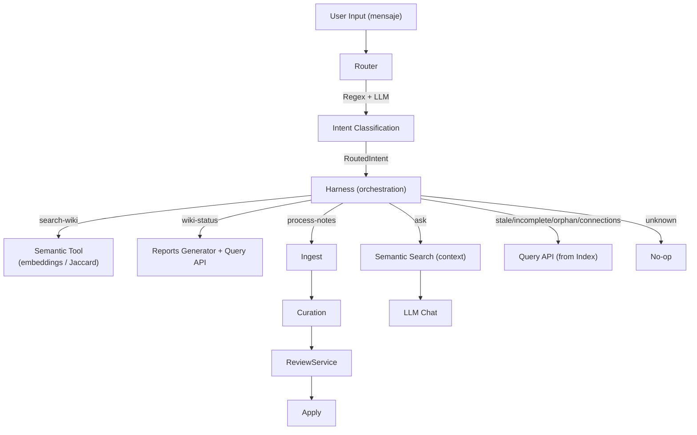
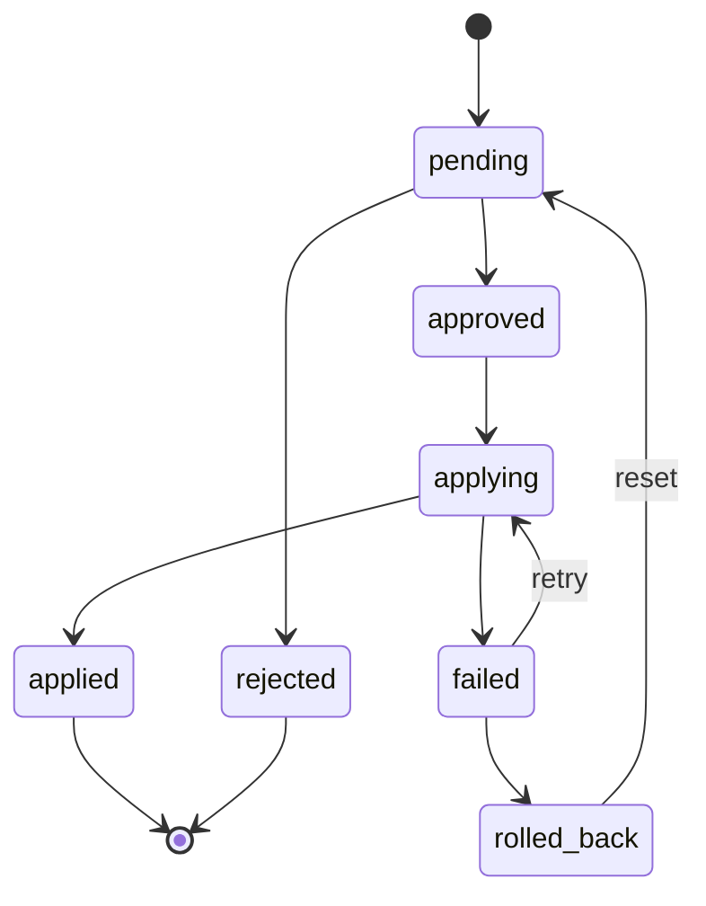
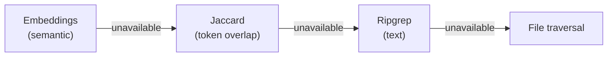

# Librarian — Agent Analysis

> Date: 2026-05-31  
> Scope: Full codebase review (~41,000 LOC, 108 source files, 39 test files)

---

## Summary

Librarian is a curation agent for Obsidian vaults (Second Brain) written in **TypeScript**. It operates in two modes: **CLI one-shot** (JSON output) and **interactive TUI** (React + Ink). The agent classifies user intents, searches notes via semantic/text/hybrid search, processes raw notes into curated wiki entries through a proposal-first pipeline, and chats about vault content using a local LLM.

---

## Tech Stack

| Layer | Technology |
|---|---|
| Language | TypeScript strict, ESModules, Node >=22 |
| TUI | Ink v7 + React 19 |
| LLM | Native `fetch()` to Ollama (no SDK) |
| Embeddings | Ollama `nomic-embed-text`, in-memory cosine similarity store |
| Search | Ripgrep with file traversal fallback |
| Tests | `node --test` + `tsx` loader |
| Runtime deps | 4: ink, ink-text-input, proper-lockfile, react |

---

## Architecture

### High-Level Data Flow

### Component Map

| Module | Key Files | Purpose |
|---|---|---|
| **Entry** | `src/index.ts` | CLI routing: commands, one-shot, or TUI |
| **Orchestration** | `src/harness.ts` | Intent dispatch, tool execution, process-notes loop |
| **Classification** | `src/router.ts` | Regex-first + LLM fallback intent classifier |
| **LLM** | `src/llm.ts` | OpenAI-compatible chat completions client |
| **Agent** | `src/agent.ts` | Observe-Plan-Act-Reflect session model |
| **Curation** | `src/curation.ts` | LLM-driven note classification, dedup, proposal generation |
| **Ingest** | `src/ingest.ts` | Raw inbox inspection, filter already-processed |
| **Indexer** | `src/indexer/` | Builder (walk vault), Parser (frontmatter/wikilinks/headings), Query API (Jaccard, BFS path), Store (persistence + fingerprinting) |
| **Embeddings** | `src/embeddings/` | Ollama provider, in-memory cosine similarity store |
| **Tools** | `src/tools/` | 6 tools: filesystem, search, semantic, frontmatter, markdownMerge, wikilinks |
| **Proposals** | `src/proposals/` | File-based CRUD (one JSON per proposal), status transitions |
| **Review** | `src/review/` | ReviewService (approve/reject/apply/retry/reset/recover), atomic apply, status machine, processed ledger |
| **Claims** | `src/claims/` | LLM-based claim extraction + contradiction detection |
| **Reports** | `src/reports.ts` | Vault status, incomplete notes, stats reports |
| **TUI** | `src/tui/` | Ink/React app: App component, state reducer, slash commands, 13 renderers, event bus, hooks |
| **Commands** | `src/commands/` | CLI subcommands: apply, init, lint, preview, proposals, save-chat |
| **Ingestion** | `src/ingestion/` | PDF and EPUB text extraction |

---

## Strengths

### 1. Proposal-First Architecture

All vault mutations go through a proposal pipeline with a finite state machine:

- `status-machine.ts` enforces valid transitions
- `apply-proposal.ts` uses atomic writes (temp + rename) with rollback
- Transaction records stored in `.librarian/transactions/`
- Recoverable states: `failed` (retry), `rolled_back` (reset)

### 2. Zero-Dependency Philosophy

- No LLM SDK — raw `fetch()` to OpenAI-compatible endpoints
- No YAML parser library — custom minimal parser in `config-loader.ts`
- No vector database — in-memory cosine similarity store
- No Markdown parser library — regex-based parsing
- Only 4 runtime dependencies total

### 3. Hybrid Router

Regex-first intent classification with LLM fallback. Efficient for known patterns (Spanish/English keywords mapped to intents with confidence scores), flexible for novel inputs.

### 4. Decoupled Tool Layer

Six independent tools with factory pattern and safety guards:
- `filesystem` — read/list with path traversal protection
- `search` — Ripgrep-backed text search
- `semantic` — embedding-first, Jaccard fallback
- `frontmatter` — CRUD operations on note frontmatter
- `markdownMerge` — section-aware merge with conflict detection
- `wikilinks` — link extraction, backlinks, graph stats

### 5. TUI Architecture

- `AppState` via `useReducer` with 15+ action types
- `WorkspaceNode` discriminated union: 13 node types
- Renderer registry pattern for decoupled view rendering
- Event bus for cross-component communication

### 6. Search with Graceful Degradation

### 7. Test Coverage

39 test files covering core modules: status machine, apply, indexer, proposals, TUI state, harness, router, curation, embeddings, search.

### 8. Documentation

- `README.md` — Comprehensive bilingual (ES/EN) documentation
- `CONTEXT.md` — Domain glossary for AI context
- `SOUL.md` — Agent personality and mission statement
- `SAFETY.md` — Safety model and write behavior documentation
- `CONTRIBUTING.md` — Development setup and PR checklist

---

## Areas for Improvement

### 1. God Component: `app.tsx`

**File**: `src/tui/app.tsx` (~760 lines)

Handles state management, slash command routing, rendering, and side effects in a single component. Should be decomposed into:
- Custom hooks for each concern (already partially done in `hooks/`)
- Smaller presentational components
- Extracted command handler dispatch

### 2. Regex-Based Markdown Parser

**File**: `src/indexer/parser.ts`

Fragile for Obsidian edge cases: callouts, embeds, Dataview queries, nested frontmatter. Consider a proper AST-based parser (e.g., `remark`/`unified` ecosystem) for robustness.

### 3. In-Memory Embeddings

**File**: `src/embeddings/memory-store.ts`

Embeddings don't persist between sessions — recalculated on every index build. Limits scalability with large vaults. Options:
- Persist to disk (SQLite, JSON)
- Use an external vector store
- Cache embeddings alongside the index

### 4. Empty Pipeline Module

**Directory**: `src/pipeline/`

Contains only type definitions and a barrel export. No implementation. Either remove it or document it as a planned abstraction.

### 5. No CI/CD

No GitHub Actions or CI configuration visible. Tests run manually. A CI pipeline should:
- Run `npm run typecheck` and `npm test` on every push
- Block merges on failure
- Report coverage

### 6. Claims & Contradiction Detection

**Files**: `src/claims/extractor.ts`, `src/claims/contradiction-detector.ts`

These modules depend 100% on LLM output with no structural validation. Risk of hallucinated claims or missed contradictions. Consider:
- Confidence thresholds
- Human review loop before marking contradictions
- Structural validation of extracted claims

### 7. LLM Client Resilience

**File**: `src/llm.ts`

Uses raw `fetch()` without:
- Retry logic
- Circuit breaker
- Timeout configuration per request
- Rate limiting
- Response validation

### 8. Configuration Complexity

Three overlapping config sources: `.env`, `config.yaml`, and hardcoded defaults in `src/config.ts`. Simplify to a single config source with clear precedence rules documented.

---

## Notable Patterns

| Pattern | Where | Description |
|---|---|---|
| Observe-Plan-Act-Reflect | `src/agent.ts` | Agentic loop with session tracking |
| Finite State Machine | `src/review/status-machine.ts` | Validated proposal transitions |
| Atomic Write + Rollback | `src/review/apply-proposal.ts` | Transactional file modifications |
| Processed Ledger + File Lock | `src/review/processed-ledger.ts` | Prevents duplicate processing |
| Renderer Registry | `src/tui/renderers/registry.ts` | Decouples node types from rendering |
| Event Bus | `src/tui/event-bus.ts` | Cross-component pub/sub |
| Factory Pattern | `src/tools/` | Tool creation with vault context injection |
| Discriminated Union | `src/tui/state.ts` | Type-safe workspace node dispatch |

---

## Verdict

Librarian is a well-designed agent with strong emphasis on **write safety** (proposal-first, atomic writes, state machine) and **dependency minimalism**. The architecture is modular and clear with good separation between orchestration, tools, indexing, and UI. The main weaknesses are the **God Component in the TUI** (`app.tsx`) and **lack of embedding persistence**. The foundation is solid for scaling to larger vaults and more complex curation workflows.
